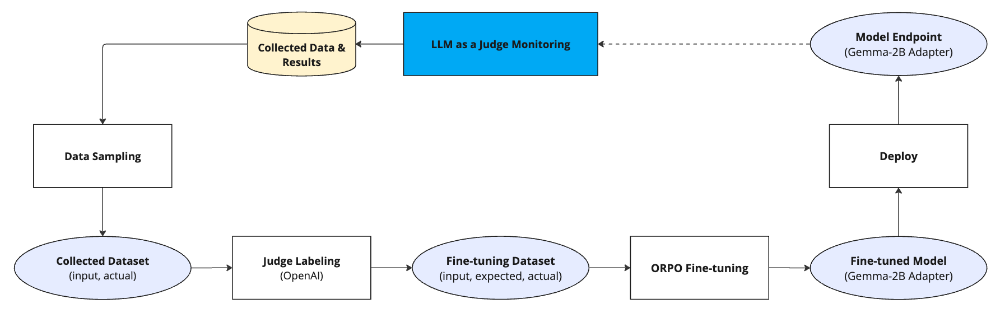

# LLM Monitoring Demo

Maintaining the performance of machine learning models in production is essential. Model monitoring tracks key metrics like accuracy, latency, and resource usage, to identify issues such as data drift and model decay. LLMs, like any other models, need to be monitored! 

In this demo, we'll develop a banking chatbot. At first the bot will answer any question in any subject. We will monitor, fine-tune and redploy it to make it more secure for answering only banking related questions. In order to do so, we'll build an automated feedback loop from detecting accuracy drift, retraining and redeployment.

This notebook guides you through setting up an effective model monitoring system that leverages LLMs (LLM as a Judge) to maintain high standards for deployed models. It demonstrates how to implement a feedback loop, from prepare and evaluate a good prompt for the LLM judge, deploy model monitoring applications, assess the performance of a pre-trained model, fine-tune it using the ORPO technique on the supplied dataset, show the monitoring results for the fine-tuned model and finally, set an automatic pipeline to automatically fine-tune the model once the monitor raised an alert.

